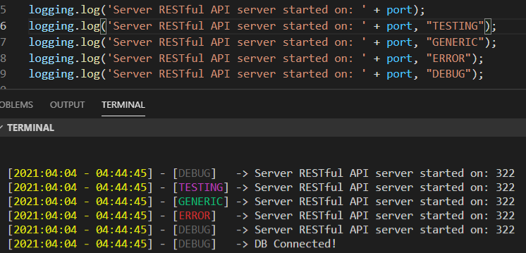

# JS-Logging

```
const logging = require("logging");

logging.log(<message>, <type>);

logging.log("Loggggginggg");            // Defaults to DEBUG type.
logging.log("Loggggginggg", "TESTING);
logging.log("Loggggginggg", "GENERIC);
logging.log("Loggggginggg", "ERROR);
logging.log("Loggggginggg", "DEBUG);
```

```
const logging = require("logging").log;

log("Thing");
```

If you modify `index.js` directly if you change [this line](https://github.com/ConniBug/JS-Logging/blob/63372d144bfd020dcd7e36f7bcb35e089b49e303/logging.js#L9) you can modify what the minimun error type will be output in the console.

